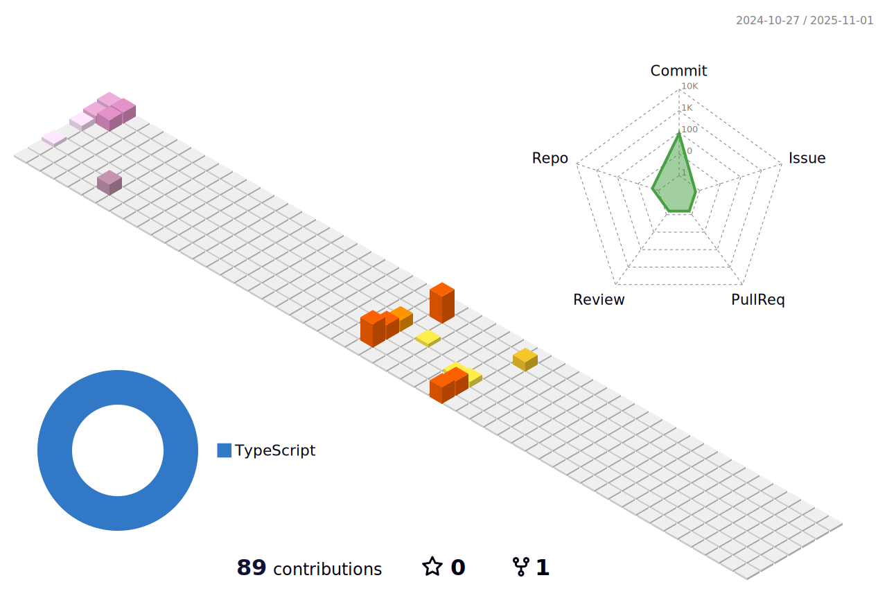

<h2> Hi, I'm Patrycja Panasiuk! </h2>

<i>Full-Stack JavaScript Developer Consultant at <a href="https://www.salt.dev/">Salt</a> </i>
</br>
</br>

Passionate about frontend development and UX/UI. I have started learning coding in 2019. It was when I had began noticing <b>how automation speeds up my work and improves efficiency</b>. I created a brand of house designs for sale from scratch. I was trying to play the role of my potential clients and I realized how important it is to <b>present information in a simple and intuitive way.</b> This is how my career path has began turning into frontend development.
As I am an <b>architect</b> - I know 3D modeling, design tools and have aesthetic sense. <b>Civil engineering</b> taught me how to solve problems and think analytically. I love psychology and self-development. I am a traveler who has seen many faces of humanity and can be empathetic, which helps in UX designing.


###  A little more about me...  

```javascript
const patrycja = {
  pronouns: "she" | "her",
  frontend: [Javascript, Typescript, HTML, CSS, Next.js, React, Redux],
  backend: [Node.js, Express.js, MongoDB, PostgreSQL],
  tools & technologies: [Figma, AdobeXD, Heroku, Vercel, Docker, Adobe, Jest, Github Actions, Mocha, Postman, VS Code],
}
```


---



